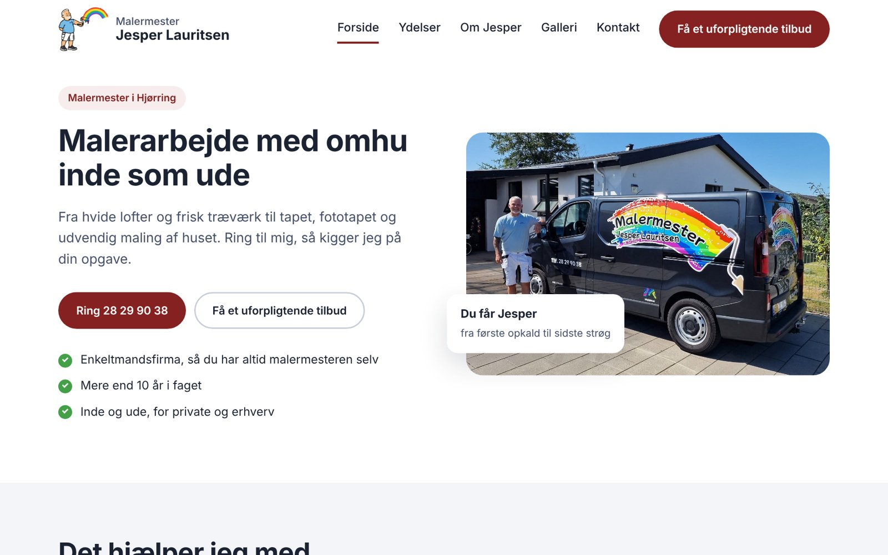

# Malermester Jesper Lauritsen – hjemmeside

Hjemmeside til Malermester Jesper Lauritsen, et enkeltmandsfirma i Hjørring, der laver malerarbejde inde og ude for private og erhverv.

**Live:** [malermester-lauritsen.pages.dev](https://malermester-lauritsen.pages.dev/)



## Baggrund

Firmaet havde kun en Facebook-side. Målet var en hjemmeside, der gør det nemt at kontakte Jesper, viser hans arbejde med rigtige før og efter-billeder, og kan findes på Google, uden faste udgifter til hosting eller et CMS.

Derfor er siden bygget som en statisk side i ren HTML, CSS og JavaScript. Den hostes gratis på Cloudflare Pages, og den eneste faste udgift er domænet.

## Funktioner

- **Fem sider:** forside, ydelser, galleri, om Jesper og kontakt
- **Før og efter-karrusel** på forsiden med pile, prikker, piletaster og swipe på mobil
- **Galleri** med filtre (indvendigt, udvendigt, tapet, erhverv) og flere billeder per opgave
- **Forstørret visning:** klik på et billede for at se det stort
- **Ofte stillede spørgsmål**, der folder sig ud med plus og minus
- **Kontaktformular**, der sender direkte til Jespers mail via Web3Forms, med dansk kvittering på siden
- **Responsivt design** med burgermenu på mobil
- **Tilgængelighed:** tastaturnavigation, synligt fokus, alt-tekster og respekt for "reducer bevægelse"
- **Søgemaskinevenlig:** titel og beskrivelse på hver side, rigtig tekst frem for tekst i billeder, sitemap

## Teknologi

| | |
|---|---|
| Opmærkning | HTML |
| Styling | CSS (custom properties, grid, flexbox), ingen frameworks |
| Funktionalitet | Vanilla JavaScript |
| Skrifttype | Manrope (Google Fonts) |
| Formular | [Web3Forms](https://web3forms.com) |
| Hosting | [Cloudflare Pages](https://pages.cloudflare.com), deployes automatisk fra GitHub |

## Struktur

```text
├── index.html          Forside
├── ydelser.html        Ydelser og "Sådan foregår det"
├── galleri.html        Galleri med filtre
├── om-jesper.html      Om Jesper og lokalt engagement
├── kontakt.html        Kontaktformular og kontaktinfo
├── sitemap.xml         Til Google
├── css/
│   └── style.css       Al styling. Farver og skrifttyper står øverst som variabler
├── js/
│   ├── billeder.js     Billeder og tekster til karrusel og galleri
│   └── main.js         Menu, karrusel, galleri, lightbox og formular
└── billeder/
    ├── galleri/        Før og efter-billeder
    └── ...             Logo, forside, Om Jesper m.m.
```

## Kør siden lokalt

Siden har ingen build-trin. Åbn `index.html` i en browser, eller start en lille lokal server fra mappen:

```bash
python3 -m http.server 8000
```

og gå til `http://localhost:8000`.

## Tilføj en ny opgave til galleriet

1. Læg billederne i `billeder/galleri/`. Gør dem gerne max 1600 px brede først, så siden loader hurtigt.
2. Åbn `js/billeder.js` og tilføj en blok i `GALLERI`:

```js
{
  kategori: "Indvendigt",            // Indvendigt, Udvendigt, Tapet eller Erhverv
  tekst: "Her har jeg malet ...",
  billeder: [
    { foer: "billeder/galleri/ny-foer.jpg", efter: "billeder/galleri/ny-efter.jpg" },
    { billede: "billeder/galleri/ny-ekstra.jpg" }
  ]
}
```

Har en opgave flere billeder, får kortet automatisk pile. Skal den også med i karrusellen på forsiden, tilføjes den på samme måde i `FOER_EFTER`.

## Deployment

Repoet er koblet til Cloudflare Pages. Hver gang der laves en commit til `main`, lægger Cloudflare den nye version op i løbet af et minut. Der er ingen build-kommando, og output-mappen er roden af repoet.

## Kreditering

Udviklet af [Cecilie Städe Kristensen](https://ceciliestadekristensen.github.io/Portfolio/index.html) i 2026. Billeder og tekster tilhører Malermester Jesper Lauritsen.
